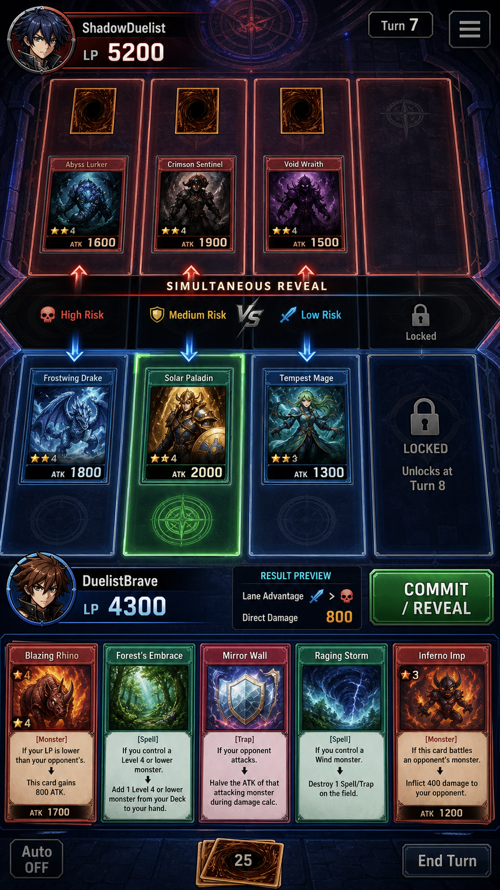

# 유희왕 레전드

./YugiohLegend_gameplay_preview.png

버전 0.11.2 | 2026-09-11 KST

## 1. 문제 정의
카드 배틀 장르는 진입장벽(룰 학습)과 덱 구성 복잡도가 높아 신규 유저 이탈이 크다. 짧은 턴 수 안에 결판나는 라이트한 3레인 전투 구조로 학습곡선을 낮추면서도 전략성을 유지해야 한다.

## 2. 페르소나
- **수집형 전략가**: 덱 빌딩과 카드 조합 최적화를 즐김.
- **라이트 대전러**: 짧은 세션(최대4턴)으로 빠르게 승부를 보고 싶어함.

## 3. 코어 루프
카드 드로우 → 몬스터/스펠/트랩 배치(3레인) → 턴 종료 시 배틀 리졸버가 레인별 공격 비교 → LP 피해 및 오버플로우 직접 피해 반영 → 다음 턴(최대4턴) → 승패 판정.

## 4. MVP 범위
- 3레인 전투 구조
- 카드 타입: 몬스터/스펠/트랩
- 라이프포인트 4000, 정확히 12장 덱, 초기 핸드 4장
- 셋업 턴1, 최대 4턴 진행
- 턴맵 기반 레인 언락
- 배틀 리졸버(레인별 공격 비교), 몬스터 HP 및 오버플로우 직접 LP 피해
- 직접피해 감소 스펠(500 경감)
- 싱글/멀티 룸, AI 대전, 덱 빌더, 온보딩/결과 씬

## 5. 레퍼런스
유희왕 듀얼링크스의 라이프포인트/직접피해 구조, 하스스톤의 짧은 턴 템포, 레인 기반 전투는 Duelyst 참고.

## 6. KPI
- 평균 대전 완료 시간(4턴 이내) 준수율 80%↑
- 덱 빌더 진입 후 12장 완성률 60%↑
- 온보딩 완주율 70%↑

## 7. 디자인 필라
1. 3레인 배치만으로도 깊은 수싸움을 만든다.
2. 최대4턴이라는 짧은 승부 호흡을 유지한다.
3. 12장 고정 덱으로 빌드 다양성보다 선택의 밀도를 높인다.

## 8. 컴포넌트 테이블
| 컴포넌트 | 설명 | 상태 |
|---|---|---|
| 카드 타입 시스템 | 몬스터/스펠/트랩 | 구현 |
| 레인 시스템 | 3레인, 턴맵 기반 언락 | 구현 |
| 덱/핸드 | 12장 덱, 초기 핸드4 | 구현 |
| 턴 진행 | 셋업턴1 + 최대4턴 | 구현 |
| 배틀 리졸버 | 레인별 공격 비교, 오버플로우 직접피해 | 구현 |
| LP 시스템 | 4000 LP, 직접피해 감소 스펠(-500) | 구현 |
| 대전 모드 | 싱글룸/멀티룸/AI | 구현 |
| 덱 빌더 | 카드 편집 UI | 구현 |
| 온보딩/결과 씬 | 튜토리얼, 결과 화면 | 구현 |

## 9. 콘텐츠
카드 3종 타입(몬스터/스펠/트랩) 조합의 12장 덱, 3레인 배치 전투, 직접피해 감소 스펠 등 특수 카드 효과.

## 10. 페이싱
셋업 턴1에서 초기 배치 → 최대4턴 내 승부 결판. 턴당 레인 공격 비교로 즉시 LP 반영해 템포 유지.

## 11. 재미 사슬(Fun Chain)
드로우(기대) → 레인 배치 수싸움(긴장) → 배틀 리졸버 결과(연출/보상 또는 좌절) → LP 변화 확인(위기감 상승) → 다음 턴 전략 수정(학습) → 승패 확정(성취/재도전 동기).

## 12. 예시 2개
1. 2턴차, 상대 레인에 몬스터 HP를 초과하는 공격을 배치해 오버플로우 직접 LP 피해로 역전 발판 마련.
2. 직접피해 감소 스펠을 미리 배치해 상대의 다음 턴 예상 딜(500 경감)을 무력화하고 반격 턴 확보.

## 13. 피로도 관리
최대4턴 캡으로 장기전 소모를 방지, 12장 고정 덱으로 매치 준비 시간을 단축해 반복 대전 피로 최소화.

## 14. 경제
대전 승패에 따른 보상(카드/재화 지급 체계는 후속 버전에서 세부 수치 정의 예정), 덱 빌더는 보유 카드 풀 내에서 12장 구성.

## 15. HUD 5상태
| 상태 | 설명 |
|---|---|
| 드로우 | 카드 드로우 연출 |
| 배치 | 몬스터/스펠/트랩 레인 배치 |
| 리졸브 | 배틀 리졸버 계산/연출 |
| 결과 | LP 변화, 오버플로우 피해 표시 |
| 종료 | 승패 및 결과 씬 |

## 16. 접근성
카드 타입별 색상+아이콘 이중 표기, LP/데미지 수치 텍스트 강조 표시.

## 17. AV(오디오/비주얼)
레인별 배틀 리졸버 임팩트 이펙트, LP 변화 시 사운드 큐, 온보딩 씬 음성/텍스트 가이드.

## 18. 현재 상태
카드 타입/레인/덱/턴진행/배틀리졸버/LP/대전모드/덱빌더/온보딩·결과 씬 모두 구현 완료.

## 19. 우선순위 3가지
1. 멀티룸 대전 안정성(동기화) 검증
2. AI 대전 난이도 밸런싱
3. 온보딩 이탈 구간 개선

# YUG v0.11.2 ADDENDUM

## 구성요소

| 역할 | 선택 | 입력→판정→피드백 | 상태 |
|---|---|---|---|
| 레인 | 3레인 | 턴 진행 → 레인 언락 조건 판정 → 언락 알림 | 명세됨 |
| 카드 타입 | 몬스터/스펠/트랩 | 카드 선택 → 타입별 효과 판정 → 효과 적용 피드백 | 명세됨 |
| 라이프포인트 | LP4000 | 데미지 입력 → LP 차감/오버플로우 판정 → LP 갱신 피드백 | 명세됨 |
| 덱/핸드 | 덱12, 초기핸드4 | 드로우 → 핸드 갱신 판정 → 핸드 표시 | 명세됨 |
| 셋업 턴 | 턴1 최대4장 | 카드 배치 선택 → 셋업 제한(최대4) 판정 → 배치 확정 피드백 | 명세됨 |
| 스펠 효과 | reduce500 | 스펠 발동 → 500 감소 판정 → LP/수치 갱신 피드백 | 명세됨 |

## 콘텐츠 제공 방식
덱12장에서 초기핸드4장을 드로우하며 시작, 턴1은 최대4장 배치로 제한. 턴 진행에 따라 3레인이 순차 언락되고, 몬스터/스펠/트랩 카드를 통해 상호작용. LP4000을 기준으로 오버플로우 데미지 및 reduce500 스펠 효과가 판정에 반영됨.

## 세션 구조
### 30초
카드 1장(몬스터/스펠/트랩) 플레이 → 즉시 판정/피드백.
### 5분
턴 진행 및 레인 언락 단위 진행.
### 30분
LP4000 소진까지의 듀얼 1판 완주.
### 장기
덱 구성/랭크 진행 — 제안(현재 명세에 없음).

## 구현됨 / 계획됨 / 제안
- 구현됨(명세 기준): 3레인, 몬스터/스펠/트랩 타입, LP4000, 덱12/초기핸드4, 셋업 턴1 최대4장, 턴별 레인 언락, 오버플로우 데미지, reduce500 스펠.
- 계획됨: 명시된 항목 없음.
- 제안: 덱 커스터마이징, 레인별 특수 규칙 확장.

## 성공 KPI
제안(측정 데이터 없음): 평균 듀얼 종료 턴 수, LP4000 소진까지 걸리는 평균 턴, 몬스터/스펠/트랩 사용 비율.

## 다음 우선순위
제안: (1) 레인 언락 타이밍별 밸런스 검증, (2) 오버플로우 데미지 계산 검증, (3) reduce500 스펠 상호작용 케이스 점검.
